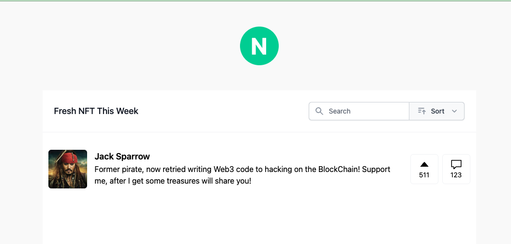
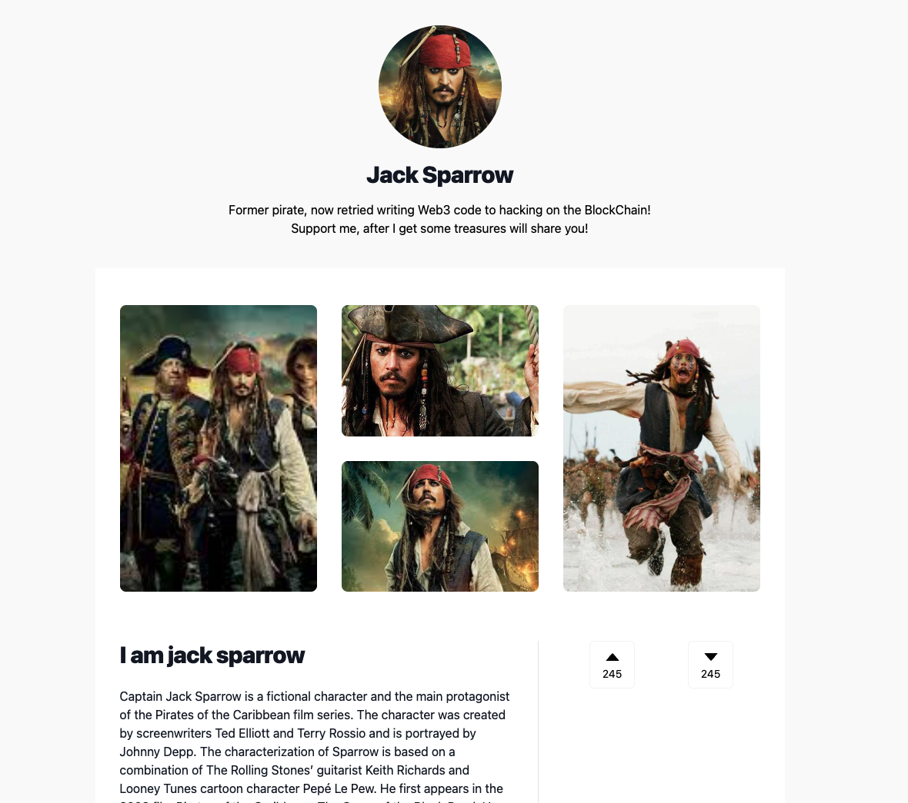

# CyberConnect Grant Apply

Here are my information about apply the grant.

As I will use the grant to push my ideas and projects further.
I have multiple ideas and also will use it in different projects and will push them all GTM and join different Web3 Hackathon, and will be benefit for all of my different projects' user.

## Milestones

1. M1/P1(1 month): W3NS project GTM inject with CyberConnect sdk in many parts

opensource: <https://github.com/NftTopBest/web3nft.social>
For now, this project just a very basic demo, and many detail need to optimized. Also a lot of feature I will build for it to go-to-market.

* optimize UX that have the follow/unfollow logic works more smoothly
* D-Blog module add `Follow/unfollow` function
* make the settings page works

2. M2/P2(2 weeks): NFTTop.best v1 mvp

As I have a new idea that want to build for NFTTop.best, now the idea is new.

* NFT project list that with CyberConnect "follow/unfollow" button on the project
* User can have a connection list modal to show all connections.
* Add every user can have their own project home page with CyberConnect function

*In the screenshot we do not have the CyberConnect Element yet, as we just start this idea, not full function yet.*

3. M3/P3(2 weeks): make a opensource vue3 CyberConnect feature plugin

* vue3 user can easily integrate CyberConnect function
* vue3 user has follow/unfollow button
* vue3 user has following list

4. M4/P4((1 month)): Launch Web3NFT.Social and NFTTop.best ideas to markets.

## Applying As Team, but currently I still working solo

Name: Bruce
Role: Web3Hacker.Ninja Founder
Email: Bruce@Web3Hacker.Ninja

## Experience

Integrate CyberConnect with my project on Eth-Shanghai: Web3 Home page && XMTP chat gating by CyberConnect, also get prize for both track.

* Prize announce link: <https://twitter.com/Web3HackerNinja/status/1534556947193950209>
* ETH Shanghai Bounty #1 and #2 link: <https://gitcoin.co/hackathon/ethshanghai?org=xmtp-labs>

## Twitter and Discord

* Twitter: [@Web3HackerNinja](https://twitter.com/web3hackerninja)
* Discord: Web3HackerNinja#7614

## Timezone

1. UTC+8 Timezone
2. The same timezone for the next few months.

## How did you hear about Cyber Grants? && Where did you learn about our grants program?

My project get into the ETH Shanghai Final-list, and connect to CyberConnect Team that invite me to join the Telegram Group: "CyberConnect Builders telegram group".
Then see the grant information from Ryan Li says: "If you wanna keep building on CyberConnect, we have a grant program too!"
